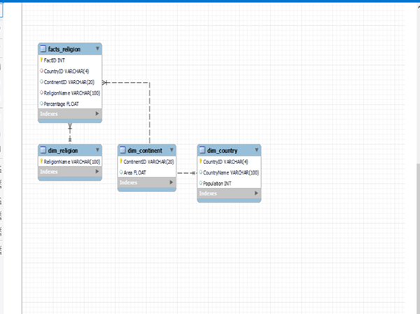

# Big Data Project 1

Ky projekt përfshin menaxhimin e të dhënave të strukturuara, importimin e Mondial DB, krijimin e queries/views/procedurave, integrimin e një dataset-i të jashtëm, dhe ndërtimin e një Data Warehouse (Star Schema).

##  Struktura e projektit

```plaintext
Project1/
│
├── DatasetCSV/           
│
├── DataWarehouse/        
│
├── mySQL/               
│
└── postgreSQL/           
```
### Star Scheme 

##  Kontribuesit
Marigona MORINA
